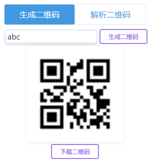

# qr_tools

This is a simple qr tools extension for Chrome. Created via [vue-chrome-extension-boilerplate](https://github.com/mubaidr/vue-chrome-extension-boilerplate).

This extension generates or parses qrs only in browser client, no network needs!

For generate, just input the text you want to create pr, then click the generate button.

For parse, copy the image to the clipboard, then in the parse page, just paste it, then click the parse button. You can click the parsed result for copying.

## Snapshots

## LICENSE

Apache License, Version 2.0
